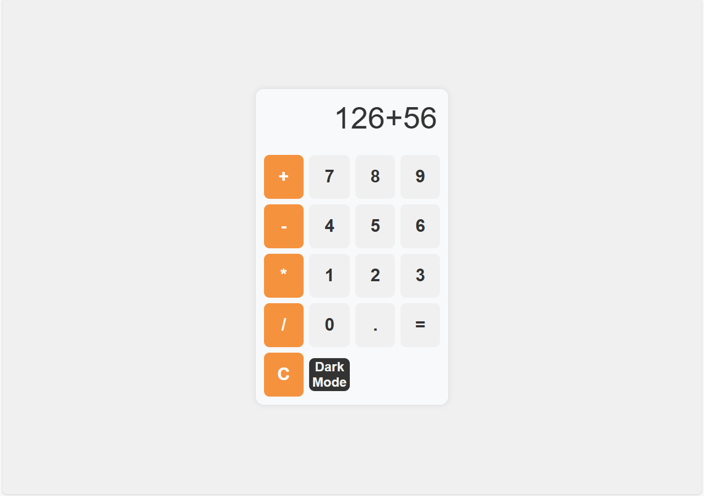
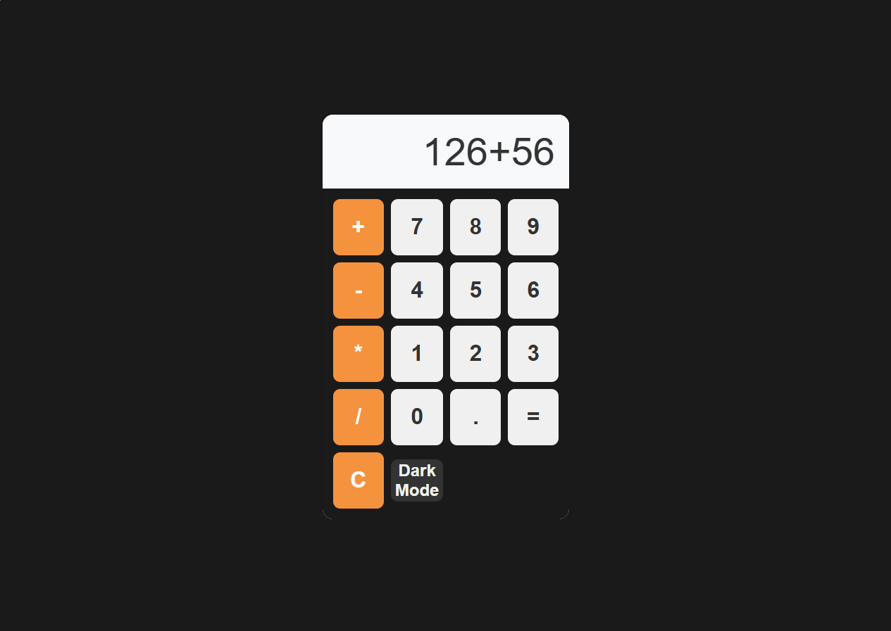

# iPhone Calculator

A simple iPhone-style calculator built using HTML, CSS, and JavaScript. This project includes a dark mode switch for enhanced usability.

## Features

- Basic arithmetic operations (addition, subtraction, multiplication, division)
- Responsive design
- Dark mode toggle

## Screenshots

### Light Mode                                                                                 
                                           

### Dark Mode
  

## Getting Started

### Prerequisites

To run this project, you need a web browser (Chrome, Firefox, Safari, etc.)

### Installation

1. Clone the repository:
   ```sh
   https://github.com/madhusankha90/JS-calculator.git
